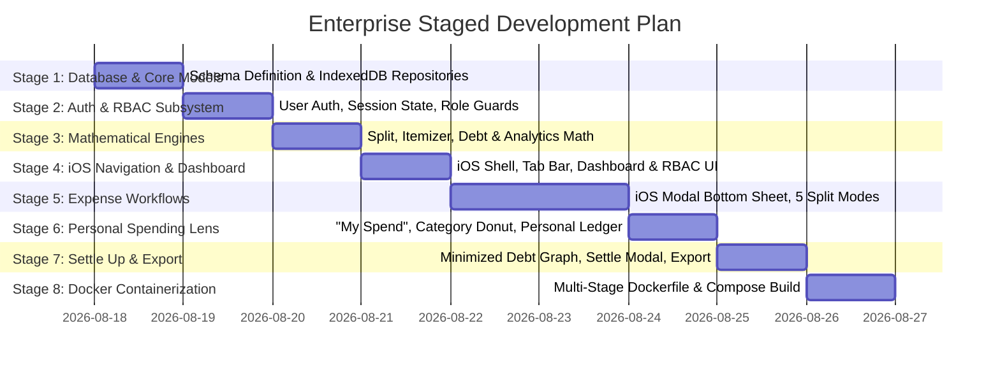

# Travel Group Expense & Individual Spending Tracker ("TravelSplit iOS")
## Enterprise-Grade Architecture & Staged Implementation Plan

---

## Executive Summary

This project delivers an enterprise-grade, iOS-focused mobile application for travel group expense management and deep individual consumption analysis. Built with **React 19 + TypeScript + Vite + Tailwind CSS + shadcn/ui**, the system features a robust **Local-First Database Layer**, **Authentication & Role-Based Access Control (RBAC)**, **5-in-1 Splitting Engine**, **Itemized Receipt Breakdown**, **Debt Minimization**, and **Multi-Stage Docker Containerization**.

Development follows a structured enterprise lifecycle:
**Database & Schema &rarr; Auth & RBAC &rarr; Core Mathematical Engines &rarr; iOS Navigation & Dashboard &rarr; Expense Workflows &rarr; Individual Analytics &rarr; Multi-Currency & Export &rarr; Docker Packaging**.

---

## Enterprise System Architecture

```
+-----------------------------------------------------------------------------------------+
|                                    PRESENTATION LAYER                                   |
|  - iOS Human Interface Guidelines (HIG) Frame + Mobile Viewport                          |
|  - shadcn/ui Design System (Radix Primitives, Tailwind CSS, Lucide Icons)                |
|  - iOS Bottom Sheets (Vaul Drawers) + iOS Segmented Controls + Frosted Blur Nav          |
|  - Dynamic Role-Aware Dashboard & Personal Analytics (Recharts)                         |
+-----------------------------------------------------------------------------------------+
                                             |
                                             v
+-----------------------------------------------------------------------------------------+
|                                 APPLICATION & RBAC LAYER                                |
|  - Auth State Machine: Session management, Login / Register / Guest Switching            |
|  - RBAC Engine: Permissions (Trip Owner, Editor/Member, Viewer/Guest)                   |
|  - Notification & Toast System (Sonner with iOS tactile styling)                        |
+-----------------------------------------------------------------------------------------+
                                             |
                                             v
+-----------------------------------------------------------------------------------------+
|                                  CORE DOMAIN ENGINES                                    |
|  - Split Engine: Equal, Exact, Percentage, Shares, Itemized Receipt Math                |
|  - Debt Optimization Engine: Greedy Bipartite Graph Debt Minimizer                      |
|  - Analytics & Ledger Engine: Individual Consumption vs Group Settlement Balances       |
|  - Currency Engine: Base conversion matrix & FX rates                                    |
+-----------------------------------------------------------------------------------------+
                                             |
                                             v
+-----------------------------------------------------------------------------------------+
|                             PERSISTENCE & REPOSITORY LAYER                              |
|  - Repository Pattern: UserRepository, TripRepository, ExpenseRepository, SettleRepo    |
|  - Local-First DB Engine: Dexie.js (IndexedDB) with LocalStorage fallback & Audit Log   |
+-----------------------------------------------------------------------------------------+
                                             |
                                             v
+-----------------------------------------------------------------------------------------+
|                               CONTAINERIZATION & DEPLOYMENT                             |
|  - Multi-stage Dockerfile (node:alpine build -> nginx:alpine runtime) (~20MB compressed)|
|  - Gzip / Brotli compression + SPA fallback routing                                     |
|  - docker-compose.yml for one-command enterprise deployment                             |
+-----------------------------------------------------------------------------------------+
```

---

## Data Models & RBAC Matrix

### 1. Entity Relational Schemas
```typescript
interface User {
  id: string;
  email: string;
  name: string;
  avatarUrl?: string;
  defaultCurrency: string;
  createdAt: string;
}

type TripRole = 'owner' | 'editor' | 'viewer';

interface TripMember {
  userId: string;
  tripId: string;
  name: string;
  role: TripRole;
  avatarColor: string;
  defaultWeight: number; // For weighted shares
}

interface Trip {
  id: string;
  name: string;
  destination: string;
  baseCurrency: string;
  startDate: string;
  endDate: string;
  createdBy: string;
  members: TripMember[];
  archived: boolean;
}

type SplitType = 'equal' | 'exact' | 'percentage' | 'shares' | 'itemized';

interface ItemizedBillItem {
  id: string;
  name: string;
  amount: number;
  assignedMemberIds: string[];
}

interface Expense {
  id: string;
  tripId: string;
  title: string;
  category: 'food' | 'transport' | 'lodging' | 'activities' | 'groceries' | 'shopping' | 'emergency' | 'general';
  amount: number;
  currency: string;
  exchangeRate: number; // relative to baseCurrency
  date: string;
  paidBy: { userId: string; amount: number }[]; // Supports single or multi-payer
  splitType: SplitType;
  splitWithMemberIds: string[]; // For subset equal/percentage/shares
  customSplits?: Record<string, number>; // exact values, %, or weights
  itemizedItems?: ItemizedBillItem[];
  taxAmount?: number;
  tipAmount?: number;
  notes?: string;
  createdBy: string;
}

interface Settlement {
  id: string;
  tripId: string;
  fromUserId: string;
  toUserId: string;
  amount: number;
  currency: string;
  date: string;
  notes?: string;
  paymentMethod: 'cash' | 'venmo' | 'revolut' | 'bank' | 'paypal' | 'other';
}
```

### 2. Role-Based Access Control (RBAC) Matrix

| Feature / Action | Trip Owner | Editor / Member | Viewer / Guest |
| :--- | :---: | :---: | :---: |
| **View Dashboard & Balances** | <span style="color:green">✔</span> | <span style="color:green">✔</span> | <span style="color:green">✔</span> |
| **View "My Spend" & Personal Donut** | <span style="color:green">✔</span> | <span style="color:green">✔</span> | <span style="color:green">✔</span> |
| **Add / Edit / Delete Own Expenses** | <span style="color:green">✔</span> | <span style="color:green">✔</span> | <span style="color:red">✖</span> |
| **Edit / Delete Other's Expenses** | <span style="color:green">✔</span> | <span style="color:red">✖</span> | <span style="color:red">✖</span> |
| **Record / Confirm Settle-Up** | <span style="color:green">✔</span> | <span style="color:green">✔</span> | <span style="color:red">✖</span> |
| **Add / Remove Trip Members** | <span style="color:green">✔</span> | <span style="color:red">✖</span> | <span style="color:red">✖</span> |
| **Change Trip Settings & Base Currency** | <span style="color:green">✔</span> | <span style="color:red">✖</span> | <span style="color:red">✖</span> |
| **Delete / Archive Entire Trip** | <span style="color:green">✔</span> | <span style="color:red">✖</span> | <span style="color:red">✖</span> |

---

## Enterprise Staged Development Lifecycle



### Stage 1: Database Layer & Data Persistence (DB)
- Configure Dexie.js / IndexedDB with repository abstractions (`UserRepository`, `TripRepository`, `ExpenseRepository`, `SettlementRepository`).
- Database migration schemas, seed data loader, and transactional integrity.

### Stage 2: Authentication & Role-Based Access Control (Auth & RBAC)
- Auth State Store (Login, Register, Logout, Demo Traveler switcher).
- Permission guard hooks (`useCanEditExpense`, `useCanManageTrip`, `useTripRole`).
- Role badges and UI permission toggles.

### Stage 3: Core Domain & Mathematical Engines
- **Split Engine**: Equal, Exact, Percentage, Weighted Shares, and Itemized Receipt split with fractional cent allocation.
- **Debt Optimization Engine**: Bipartite greedy debt minimization algorithm.
- **Individual Analytics Engine**: Total consumption aggregation, category breakdown, and personal ledger extraction.
- **Unit Tests**: Full coverage for split rounding, circular debts, and itemized tax/tip apportionment.

### Stage 4: iOS Mobile UI System, Navigation & Dashboard
- iOS Human Interface Guidelines (HIG) mobile layout with frosted header and bottom tab bar.
- Traveler switcher (`Viewing as: Alex (Owner) ▾`).
- Trip summary cards (Total Spent, Settlement Status, Member Avatars, Category Overview).

### Stage 5: Expense Entry Workflows & Itemized Receipt Builder
- iOS-style Modal Bottom Sheet (Vaul Drawer) with fluid drag-to-dismiss.
- Multi-payer support.
- 5 split modes with live validation.
- Interactive receipt itemizer: enter dishes, tap member chips, auto-distribute tax/tip.

### Stage 6: Individual Spending Dashboard ("My Spend")
- True personal consumption vs out-of-pocket metrics.
- Recharts category breakdown donut chart + percentage summary.
- Itemized personal consumption ledger.

### Stage 7: Debt Settlement Hub & Enterprise Export
- Minimized "Who Pays Whom" cards.
- Record settlement modal with payment method tags (Venmo, Cash, Bank, etc.).
- CSV export for spreadsheets, printable trip summary, JSON backup/restore.

### Stage 8: Multi-Stage Docker Containerization & Compression
- Multi-stage `Dockerfile`:
  - Builder stage: `node:22-alpine` compiling Vite production bundle.
  - Production runtime: `nginx:alpine` serving compressed static assets with Gzip, cache headers, and SPA fallback.
- `docker-compose.yml` for 1-command startup.
- Complete container build verification.

---

## Verification & Validation Plan

### Automated Test Suite
1. **Math & Splitting Verification**:
   - $100 split 3 ways equals $33.34 + $33.33 + $33.33.
   - Itemized bill with 8% tax & 18% tip proportionally allocated to individual dish totals.
2. **RBAC Verification**:
   - Viewer cannot add/edit expenses or delete trips.
   - Editor can edit own expenses but not trip settings.
   - Owner has full administrative permissions.
3. **Debt Graph Verification**:
   - 3-party circular debt (A owes B, B owes C, C owes A) cancels to 0 payments.
4. **Data Integrity Verification**:
   - Total group expenses $\equiv \sum \text{Individual Consumed}$ across all members.

### Container & Build Verification
- Execute `docker build` & verify image size is compressed under 25MB.
- Run `docker compose up` and verify complete functionality at `http://localhost:3000`.
