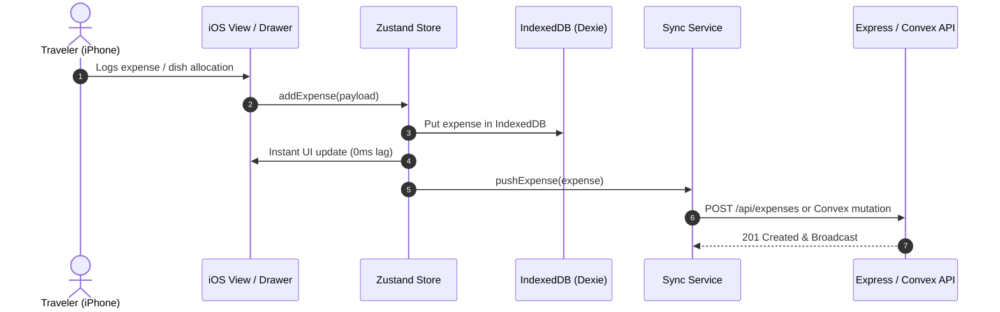

# TravelSplit iOS — Technical Architecture Documentation

## 1. System Overview

TravelSplit iOS is an enterprise-grade, mobile-first travel group expense splitting and individual consumption tracking application. It bridges the gap between group debt balancing (who owes whom) and deep individual expenditure analysis (what did I personally consume).

```
+-----------------------------------------------------------------------------------------+
|                                    PRESENTATION LAYER                                   |
|  - iOS Human Interface Guidelines (HIG) Frame with iPhone 16 Pro Viewport & Dynamic Island|
|  - shadcn/ui Design System (Radix UI Primitives, Tailwind CSS, Lucide Icons)            |
|  - iOS Bottom Sheets (Vaul Drawers) with Spring Drag Physics                            |
|  - Interactive Recharts Visualizations (Personal Category Donut & Expense Trends)       |
+-----------------------------------------------------------------------------------------+
                                             |
                                             v
+-----------------------------------------------------------------------------------------+
|                                 APPLICATION & RBAC LAYER                                |
|  - Auth State Machine (useAuthStore): Session management, Persona Switching             |
|  - RBAC Engine (rbacEngine): Permissions (Trip Owner, Editor/Member, Viewer/Guest)      |
|  - UI State Store (useUiStore): Drawers, Modals, Active Navigation Tabs                 |
+-----------------------------------------------------------------------------------------+
                                             |
                                             v
+-----------------------------------------------------------------------------------------+
|                                  CORE DOMAIN ENGINES                                    |
|  - Split Engine (splitEngine.ts): Equal, Exact, %, Shares, Itemized Receipt Math        |
|  - Debt Optimizer (debtEngine.ts): Greedy Bipartite Graph Debt Minimizer                |
|  - Analytics (analyticsEngine.ts): True Individual Consumption vs Paid Upfront          |
|  - Currency Engine (currencyEngine.ts): Real-time Base FX Conversion Matrix             |
+-----------------------------------------------------------------------------------------+
                                             |
                                             v
+-----------------------------------------------------------------------------------------+
|                                 HYBRID PERSISTENCE LAYER                                |
|  - Local-First DB (Dexie / IndexedDB): 100% Offline Travel Storage                      |
|  - Dedicated REST API (Node.js/Express + SQLite): Multi-Device Join Codes & Sync        |
|  - Convex Serverless Real-Time DB: Reactive WebSocket Live Synchronization              |
+-----------------------------------------------------------------------------------------+
```

---

## 2. Component Structure

- **`src/components/ios/`**: iOS layout frame (`IosFrame`), status bar (`IosStatusBar`), frosted header (`IosHeader`), bottom tab bar (`IosBottomTabBar`).
- **`src/components/trips/`**: Trip hero banner, trip switcher list (`TripListView`), trip creator (`CreateTripModal`), member role manager (`MemberManagerModal`), join code modal (`JoinTripModal`).
- **`src/components/expenses/`**: Expense ledger (`ExpenseListView`), filter pills, and bottom sheet drawer (`AddExpenseModal`) with 5 split mode controls and receipt itemizer.
- **`src/components/myspend/`**: Individual consumption lens (`MySpendView`), category donut chart, and personal line-item ledger.
- **`src/components/settle/`**: Debt minimization cards (`SettleUpView`), record settlement drawer, payment method picker, and confetti trigger.
- **`src/components/export/`**: Summary report modal (`ExportReportModal`) with CSV download and chat clipboard copy.
- **`src/components/audit/`**: Enterprise audit trail modal (`AuditLogModal`).
- **`src/components/common/`**: React Error Boundary (`ErrorBoundary`).

---

## 3. Data Flow & Hybrid Synchronization


